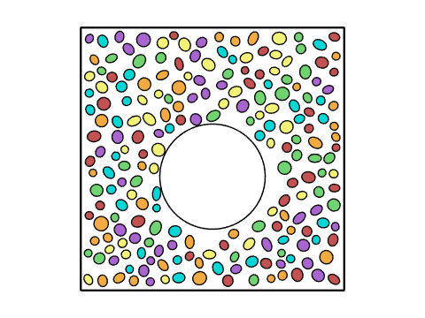
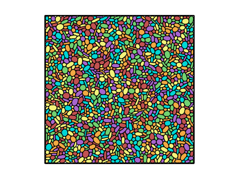
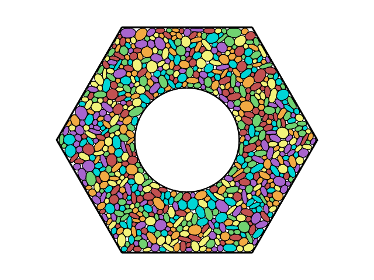
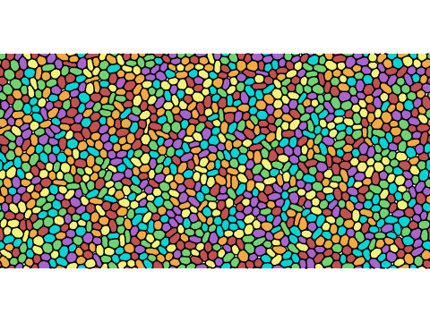

# Squishy Particle Simulator

> Note: I've just been monkeying around with this for a few months and got it up running. I haven't done much with it and wrote the code around Feb-May of 2024. The text below was written by ChatGPT o4 high reasoning model (one shot) without edits from me. It read the code and the reference below, and based on its interpretation wrote this document.

A MATLAB-based 2D deformable–polygon model (DPM) for “squishy” particles, where each particle’s perimeter is discretized into vertices and bending moments penalize deviations from its equilibrium shape. This repository includes example scripts, core engine functions, and pre-rendered looping GIFs to showcase different deformation and flow scenarios.

---

## 🎬 Demonstrations

|  |   | 
|------------------------------|-------------------------------------|
|  |  |
|  |  | 


---

## 📖 Overview

Our simulator implements the **Deformable Particle Model (DPM)** introduced by Boromand *et al.* for jammed packings of deformable polygons, but replaces the standard perimeter‐penalty term with a **bending‐moment** energy that directly penalizes curvature deviations from the equilibrium shape citeturn0file3. Particles interact via:

- **Area elasticity** – quadratic penalty for deviations from their preferred area.  
- **Bending elasticity** – quadratic penalty for changes in the angle between adjacent perimeter segments.  
- **Repulsive contacts** – pairwise overlap forces to prevent interpenetration.

---

## 🗂️ Repository Structure

```
root/
├── matlab/              
│   ├── RunExample_Gravity.m     # Main driver: choose Gravity, Couette, Shear, etc. citeturn0file0
│   ├── TimeIntegrate3.m         # Verlet‐style integrator with adaptive timestep citeturn0file1
│   ├── InitializeParams.m       # Sets all model parameters and boundary conditions citeturn0file2
│   ├── GenRandomEllipses.m      # Generates non‐overlapping ellipsoidal initial packings
│   ├── GenEllipses2.m           # Discretizes ellipses into equally spaced vertices
│   ├── DrawCells.m              # Visualization helper
│   └── ScaleCells.m             # Uniformly grows/shrinks particles for packing‐fraction control
├── GIFs/                        
│   ├── Gravity.gif              
│   ├── HexCouette.gif           
│   ├── HexCouetteSoft.gif       
│   ├── SimpleShearMedium.gif    
│   ├── SimpleShearSoft.gif      
│   └── SimpleShearStiff.gif     
└── README.md                     # ← You are here
```

---

## 🚀 Quick Start

1. **Add to MATLAB path**  
   ```matlab
   addpath(genpath('matlab'))
   ```
2. **Run an example**  
   ```matlab
   RunExample_Gravity  % Toggle examples and parameters at the top of this script
   ```
3. **View pre-rendered GIFs**  
   Open any of the files in `GIFs/` or embed them in your own Markdown:
   ```markdown
   
   ```

---

## ⚙️ Model Differences

- **O’Hern vertex model** uses a perimeter‐penalty term  
  ```
    U_p ∝ (p - p_0)^2
  ```
  to enforce preferred perimeter `p_0`.  
- **This implementation** replaces that with a **bending moment** penalty at each vertex,  
  ```
    U_b ∝ Σ_i (θ_i - θ_{0,i})^2,
  ```
  where `θ_{0,i}` is the equilibrium angle between adjacent segments.

---

## 📚 References

- Boromand, A., Signoriello, A., Ye, F., O’Hern, C. S., & Shattuck, M. D. (2018). *Jamming of Deformable Polygons*. Phys. Rev. E, **97**, 062903. citeturn0file3


